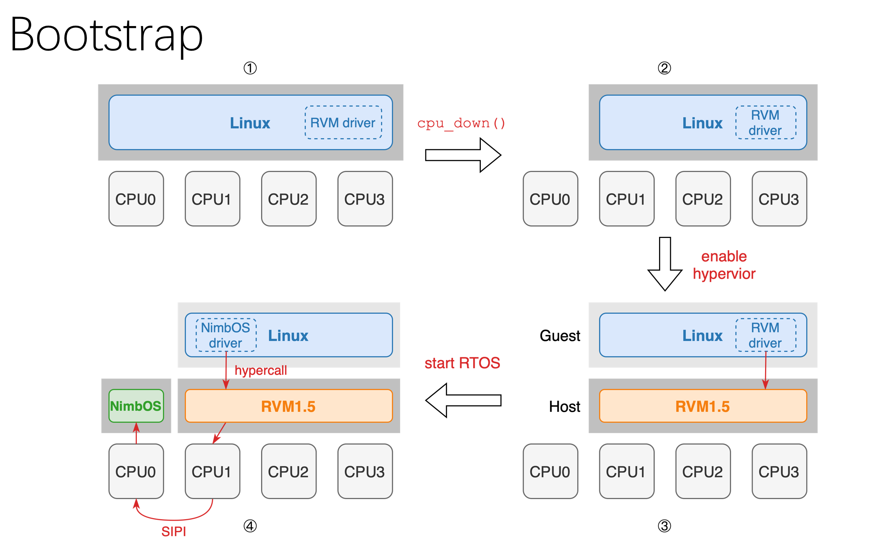
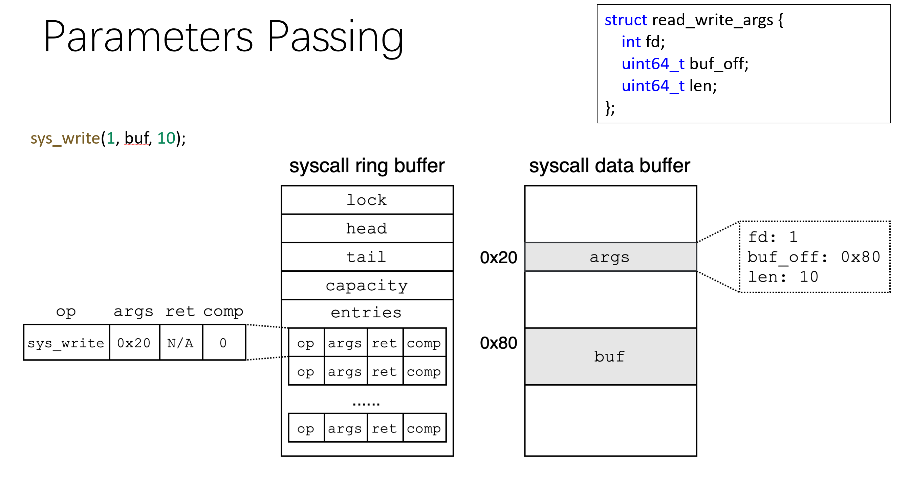

<!-- theme: gaia -->
<!-- _class: lead -->
# 操作系统内核
# 研究汇报
 
<br>

张悠慧 武永卫 陈渝 陈康  

清华大学
<br>

2022.4.21

---

### 提纲
- **研究目标**
- **相关背景**
- **总体介绍**
- **应用分析**


---

### 提纲
- **研究目标**
  - 下一个50年的OS？
  - 应用领域
     - AIoT/Robot/VR...
  - 应用要求
     - 安全、高性能、确定性、低延时、定制化、一体化...
  - 挑战与机遇
    - 将带来OS的变革   


<!-- ---

### 提纲

- **相关背景**
- 总体介绍
   - 基于Rust的操作系统内核 -- zCore
- 创新设计
   - 异步协程（async coroutine）优化
   - 用户态中断（usr intr）优化
   - 协作式虚拟化（coop hyper）优化
   - 跨特权级代码共享 -->

---
- **相关背景**  -- 产业界

 - 国内外OS 

  - 国内通用OS：
    - openeuler，统信，麒麟，龙蜥，opencloud...
    - 国内大厂支持，都基于Linux，缺少核心创新


---
- **相关背景** 

 - 国内外OS -- 产业界


  - 国内嵌入式OS
     - 鸿蒙os，ali things os，腾讯TencentOS tiny，sylixos，rtt, reworks，detlaos, spaceos,...
     - 传统RTOS的简化技术，难以适应AIoT的复杂场景

---
- **相关背景** -- 学术界
- 面向新型硬件，采用新型编程语言的OS研究
- 缺少生态和实际应用
- 侧重性能等方面，对安全等考虑较少


---
- **相关背景** 

**OS相关问题**

- 安全问题
- 性能问题
- 研发问题
- 生态问题


---
- **相关背景** -- OS 安全问题


---
- **相关背景** -- OS 安全问题


---
- **相关背景** -- OS 安全问题


---
- **相关背景** -- OS 安全问题


---
- **相关背景** -- OS 安全问题


---
- **相关背景** -- OS 安全问题


---
- **相关背景** -- OS 安全问题


---
- **相关背景** -- OS 安全问题


---
- **相关背景** -- OS 性能问题
  - 在多核支持、确定性执行、低延迟、新型硬件支持等方面还需改进


---
- **相关背景** -- OS 研发问题
  - 内核代码开发难度大，代码难以复用
  - 应用开发方式无法有效重用，研发生态困难


---
- **相关背景** 

OS 生态问题
- 桌面：windows
- 服务器：Linux
- 移动端：Android
- 嵌入式：VxWorks
- AIoT/Robot
  -  战国时代


<!-- ---
### 相关背景
- 基于新高级语言的OS，在上述三方面进行探索
  
 -->

<!-- ---
### 相关背景
- 基于新高级语言的OS
 -->

---

### 提纲
- 基于Rust的操作系统内核 -- zCore
  - 定位与目标
  - 关键技术
  - 当前情况


<!-- ### 提纲
- 总体介绍
   - 基于Rust的操作系统内核 -- zCore
- 创新设计
   - 异步协程（async coroutine）优化
   - 用户态中断（usr intr）优化
   - 协作式虚拟化（coop hyper）优化
   - 跨特权级代码共享 -->

---
### 总体介绍 -- zCore定位与目标
**定位**
- 需要面向特定典型场景定制专用操作系统
   - 面向AIoT/Robot/工业控制领域
      - 现在和未来有广泛的应用需求
      - 现有通用操作系统太大太重
      - 现有嵌入式操作系统功能单
---
### 总体介绍 -- zCore定位与目标
**目标**

探索用Rust语言开发OS kernel，结合软硬件协同优化达到如下具体目标：
- 安全（基于Rust语言）
- 高吞吐量（基于异步协程和用户态中断机制）
- 实时&通用（基于协作式虚拟化的隔离机制）
- 支持 POSIX接口（兼容生态）
- 内核模块可按应用方式开发（便捷开发）

---
### 总体介绍 -- zCore关键技术
**安全**
   - 基于Rust编程语言和基于能力的架构设计
     - 无传统C语言的内存类缺陷和并发类缺陷
     - 采用编译和运行时安全检查
     - 避免Java/Go/C#等的为安全带来的性能损失
 

---
### 总体介绍 
zCore关键技术

**性能**  
   - 异步协程
      - async coroutine
      - 降低内存消耗
      - 减少切换开销
   - 用户态中断
      - usr interrupt
      - 加速进程通信性能
 
 
 
---
### 总体介绍 
zCore关键技术

**性能**  
  - 协作式隔离
  - 系统虚拟化
  - 保证硬实时
  - 重用Linux服务
   
---
### 总体介绍 -- zCore关键技术
**开发与生态**       
   - 跨特权级代码共享
     - 用户态开发调试
     - 直接运行在内核
   - 支持POSIX接口
     - 重用Linux App  
  
<!-- ---
### 总体介绍 -- zCore关键技术
**生态**     
   - 协作式虚拟化（coop hyper）优化

---
### 总体介绍 -- 目标完成情况
探索用Rust语言开发OS kernel和Hypervisor，结合软硬件协同优化达到如下目标：
- 安全（基于Rust语言）
  -  rCore、zCore、RVM等
  
确实减少了内核bug，但对于unsafe code中的bug，依然难以避免 -->


---
### 应用分析


---
### 总体介绍 -- 目标完成情况
探索用Rust语言开发OS kernel，结合软硬件协同优化达到如下目标：
- 高吞吐量（基于异步协程）
  -  zCore with async
     -  内核协程化
         -  扩展Rust Async 机制
         - 重新思考 异步syscall以及异步调度

---
### 总体介绍 -- 目标完成情况
探索用Rust语言开发OS kernel，结合软硬件协同优化达到如下目标：
-  高吞吐量（基于用户态中断）
  -  zCore with uIntr
     -  支持用户态中断(uIntr)
         -  用户态直接响应外设中断和核间中断
         - 重新思考OS Kernel的事件
  - 修改RISC-V CPU支持N Spec 


---
### 总体介绍 -- 目标完成情况
探索用Rust语言开发OS kernel和Hypervisor，结合软硬件协同优化达到如下目标：
- 实时（基于协作式虚拟化的隔离机制）
  -  zCore with RVM + NimbOS
     -  RVM以Linux Kernel Module形态运行
     -  RVM是1.5 type hypervisor
     -  NimbOS时一个实时RTOS
     - 运行在NimbOS上的APP可得到Linux的Syscall服务
 

---

### 提纲

- **相关背景**
- 总体介绍
   - 基于Rust的操作系统内核 -- zCore
- 创新设计
   - 异步协程（async coroutine）优化
   - 用户态中断（usr intr）优化
   - 协作式虚拟化（coop hyper）优化
   - 跨特权级代码共享

---
### zCore
zCore: A Next Gen Rust OS
- Rust 语言编写的“混合”操作系统内核
  - 同时支持 Linux 和 Zircon 系统调用
  - 同时支持 LibOS 和 裸机 OS 形式
  - 可以完全在用户态开发、测试、运行
-  内核协程化


---

### zCore - 项目规模
自主研发，目前大约3万行左右代码量


---
### zCore - 运行展示
zCore: Linux LibOS on macOS


---

### zCore -  完成度
Zircon 官方系统调用测试集


---

### zCore - 对系统调用/标准库的支持


---

### zCore - 对系统调用/标准库的支持


---
### zCore - 对系统调用/标准库的支持
 

---
### zCore - 对系统调用/标准库的支持


---
### zCore -  Benchmark

基于 Ubuntu 20.04，QEMU-KVM 1 CPU 测试


---
### zCore -  Benchmark
基于 Ubuntu 20.04，QEMU-KVM 1 CPU 测试


<!-- ---

### zCore -  自动测试

文档与CI/CD集成测试
- `#![deny(warnings)]`：警告报错
- cargo fmt && clippy：检查代码格式和风格
- cargo build：保证所有平台编译通过
- cargo test：用户态单元测试，报告测试覆盖率
- core-test：内核态集成测试，维护通过测例列表
- （TODO）cargo bench：性能测试

上述测试全部通过才允许合入 master -->

<!-- ---

###  总体介绍 -  模块化
rCore OS 生态
拆成小型 no_std crate，每个专注一件事：
  - `trapframe-rs`：用户-内核态切换
  - `rcore-console`：在 Framebuffer 上显示终端
  - `naive-timer`：简单计时器
  - `executor`：单线程 Future executor
  - ……

---

###  总体介绍 -  zCore架构设计文档
zCore 架构设计文档


---

###  总体介绍 -  zCore系统调用文档
zCore 系统调用文档


---

### 提纲

- 相关背景
- 总体介绍
- **内核设计**
  - **用户态HAL**
  - 内核异步调度
  - Zircon 内核对象
---

### 内核设计 -- 用户态HAL
HAL 硬件抽象层的设计实现


---

### 内核设计 -- 用户态HAL
需求：内核对象单元测试

- 测试对象：线程 `Thread`，内存映射 `VMO`，`VMAR`

- 但 `cargo test` 只能在开发环境用户态运行

- 思考：能否在用户态**模拟**页表和内核线程？

---

### 内核设计 -- 用户态HAL
方案：用户态模拟内核机制

- 内核线程：等价于用户线程 `std::thread`

- 内存映射：Unix `mmap` 系统调用

    - 用一个文件代表全部物理内存
    - 用 `mmap` 将文件的不同部分映射到用户地址空间


---

### 内核设计 -- 用户态HAL
HAL API 举例

- 内核线程：`hal_thread_spawn`
- 物理内存：`hal_pmem_{read,write}`
- 虚拟内存：`hal_pt_{map,unmap}`
- 用户态：`hal_context_run`
- 定时器：`hal_timer_{set,tick}`
- 输入输出：`hal_serial_{read,write}`
- 设备管理：`hal_irq_{enable,handle}`

---
### 内核设计 -- 用户态HAL
潜在问题

- 用户线程难以细粒度调度
- “页表”共享同一个地址空间


---

###  内核设计 -- 用户态HAL
Challenge：用户-内核态切换 🧙‍♀️
- 控制流转移：系统调用 -> 函数调用
    - `int 80` / `syscall` -> `call`
    - `iret` / `sysret` -> `ret`
    - 需要修改用户程序代码段！

- 上下文恢复：寻找 "scratch" 寄存器
    - 用户程序如何找到内核入口点？内核栈？
    - 利用线程局部存储 TLS，线程指针 fsbase
---

###  内核设计 -- 用户态HAL
进一步思考：用户态 OS

既然每个内核对象都能在用户态完成其功能，
那么整个 OS 可不可以完全跑在用户态呢？

- 潜在好处
- 充分利用开发工具，降低开发难度：
IDE + gdb + cargo + perf ...

- 现有解决方案

Library OS，User-mode Linux -->


---

### 提纲

- **相关背景**
- 总体介绍
   - 基于Rust的操作系统内核 -- zCore
- 创新设计
   - 异步协程（async coroutine）优化
   - 用户态中断（usr intr）优化
   - 协作式虚拟化（coop hyper）优化
   - 跨特权级代码共享


---

### zCore -- 异步调度
async Rust 原理和设计模式


---

### zCore -- 异步调度
`async-await`：用同步风格编写异步代码

- 本质：无栈协程，协作式调度

- 适用于高并发 IO 场景

---
### zCore -- 异步调度
`async-await`：用同步风格编写异步代码

应用情况：

- 需要编译器的特殊支持：函数 => 状态机对象
- 主流编程语言均已支持：C#，JavaScript，Python，C++
- 几乎没有在 bare-metal 中应用


---
### zCore -- 异步调度
- 异步 syscall 与内核协程调度
- io_uring 与异步 syscall
  


---

### zCore -- 异步调度
异步 syscall测试


---

### zCore -- 异步调度

  zCore: free-polling + uintr

  |              | CPU | Latency | Locality |       备注       |
  | :----------: | :-----: | :-----: | :------: | :--------------: |
  |   syscall    |    👍    |    👍    |    😰     |              |
  |   polling    |    😰    |    👍    |    👍     | 高速设备 |
  | free-polling |    👍    |    😰    |    👍     |              |
  |    uintr     |    👍    |    👍    |    👍     | 硬件支持 |


---

### zCore -- 异步调度 
可抢占协程

- 异步执行 latency 的累加
  - 用户提交 => 内核识别, 内核提交 => 用户识别 
     - uintr  or  polling
  - interrupt => 内核响应
    - 优先级，可抢占协程
- 协程不可抢占  =>  重新回到线程
  - 在中断 handler 里新建一个线程 （线程池）
  - 协程的线程间迁移

---

### zCore -- 异步调度 

- 协程的类型
  - 内核协程
  - 用户协程
- CPU Core专用化
  - 内核Core：运行内核协程，切换开销小
  - 用户Core：运行用户协程，切换开销大
  - 如果更进一步：IO Core，Net Core
- 问题：load balance


---
### zCore -- 异步调度
协程切换开销

- thread switch  =>  function return and call
- lmbench lat-ctx

```shell
Context switching - times in microseconds - smaller is better
-------------------------------------------------------------------------
Host                 OS  2p/0K 2p/16K 2p/64K 8p/16K 8p/64K 16p/16K 16p/64K
--------- ------------- ------ ------ ------ ------ ------ ------- -------
proc switch             0.3900 0.8800 0.8900 1.9200 2.2700 2.11000 2.25000
coroutine switch        0.0330 0.0390 0.0390 0.0600 0.0600 0.06800 0.06800
```

- 协程的内存开销 $\approx$ Max{ 同时存活的状态之和 }

---

### zCore -- 异步调度
```rust
fn handler(mut stream: TcpStream) -> Result<()> {
    let mut buf = [0; 1024];
    let len = stream.read(&mut buf)?; // may block
    stream.write_all(&buf[0..len]))?; // may block
}
```
协程化

```rust
// fn handler(...) -> impl Future<Output = Result<()>>
async fn handler(mut stream: TcpStream) -> Result<()> {
    let mut buf = [0; 1024];
    let len = stream.read(&mut buf).await?;
    stream.write_all(&buf[0..len])).await?;
}
```

---
### zCore -- 异步调度
异步调度：底层 --> 中层 --> 上层


<!-- ---


### zCore -- 异步调度
底层：中断/异常事件处理：手动构造 Future
```rust
// 例：在内核对象上等待信号
fn wait_signal(&self, signal: Signal) -> WaitSignal {

    struct WaitSignal {...}     // 定义一个状态机结构
    impl Future for WaitSignal { // 实现 Future trait 的 poll 函数
        type Output = Signal;
        fn poll(self: Pin<&mut Self>, cx: &mut Context)
            -> Poll<Self::Output>
        {
            if self.signal().contains(signal) { // 若目标事件已发生，直接返回 Ready
                return Poll::Ready(signal);
            }
            
            let waker = cx.waker().clone(); // 尚未发生：注册回调函数，当事件发生时唤醒自己
            self.add_signal_callback(move || waker.wake());
            Poll::Pending
        }
    }
    WaitSignal {...}   // 返回状态机对象
}
```

---

### zCore -- 异步调度
中层：事件组合处理：用 async-await 组合 Future

```rust
async fn sys_object_wait_signal(...) -> Result {
    ...
    let signal = kobject.wait_signal(signal).await;
    ...
}
```

---

### zCore -- 异步调度
中层：事件组合处理：用 async-await 组合 Future
用法：用 `select` 组合子实现 超时处理 和 异步取消

```rust
async fn sys_object_wait_signal(..., timeout) -> Result {
    ...
    let signal = select! {
        s = kobject.wait_signal(signal) => s,
        _ = delay_for(timeout) => return Err(Timeout),
        _ = cancel_token => return Err(Cancelled),
    };
    ...
}
```


---

###  zCore -- 异步调度
上层：异步内核函数：Executor 运行 Future
- libos：`tokio` / `async-std`，支持多线程，可以模拟多核
- bare：`rcore-os/executor`，简易单核
- 未来：期望嵌入式社区的 `async-nostd`？ -->


---

###  zCore -- 异步调度
挑战：进出用户态问题

async 要求保持内核上下文（即内核栈）

- 传统 OS：User调用Kernel，平时内核栈清空
- zCore：Kernel调用User，保留内核上下文
-  问题：磁盘 IO 核，网络核， load balance？ 

<!-- 


---
### 提纲

- 相关背景
- 总体介绍
- **内核设计**
  - 用户态HAL
  - 内核异步调度
  - **Zircon 内核对象**
---

### Zircon 内核对象
Fuchsia 和 Zircon


---

### Zircon 内核对象  -- 特点

- 实用主义微内核

- 使用 C++ 实现，支持 x86_64 和 ARM64
- 面向对象：将功能划分到内核对象
- 默认隔离：使用 Capability 进行权限管理
- 安全考量：强制地址随机化，使用 vDSO 隔离系统调用

--- 
### Zircon 内核对象  -- 用户执行环境


---

### Zircon 内核对象  -- 主要组成
- Everything can be KernelObject
  - 任务：Job, Process, Thread, Exception
  - 内存：VMAR, VMO, Pager, Stream
  - IPC：Channel, FIFO, Socket
  - 信号：Event, Timer, Port, Futex
  - 驱动：Resource, Interrupt, PCI ...

---

### Zircon 内核对象  -- Object

- Object：内核对象
- Rights：对象访问权限
- Handle = Object + Rights：对象句柄（类似 fd）


---

### Zircon 内核对象  -- IPC

- Channel：进程间通信基础设施，可以传递数据和 handle
- FIFO：报文数据传输
- Socket：流数据传输


---

### Zircon 内核对象  --  Tasks
 
- Job：作业，负责控制权限（类似容器）
- Process：进程，负责管理资源
- Thread：线程，负责调度执行


---

### Zircon 内核对象  --  MAS
Memory and Address Apace

- VMO: Virtual Memory Object
  - Paged：分页物理内存，支持写时复制
  - Physical：连续物理内存
    <!-- - 一段连续的虚拟内存，可以用于在进程之间、内核和用户空间之间共享内存
    - 在内核中被维护为类似线段树的数据结构，支持从一个VMO中创建新的VMO -->

<!-- - VMAR: Virtual Memory Address Region
    - 代表一个进程的虚拟地址空间
    - 树状结构 -->


<!-- - VMO可以被映射到VMAR中，默认为内核进行位置随机，或用户态指定位置但可能失败。

- Pager：用户态分页机制 -->

<!-- ---

### Zircon 内核对象  --  Signaling /Waiting

每个 Object 有 32 个信号位，用户程序可以阻塞等待。

- Event (Pair)：事件源/对
- Timer：计时器
- Futex：用户态同步互斥机制
- Port：事件分发机制（类似 epoll）

 -->

---
# 异步 syscall 与内核协程调度
## io_uring 与异步 syscall


---

## 异步 syscall 简单测试


* allwinner nezha riscv

---

## 异步 syscall 的感知

* 如何感知异步 syscall ?

  |              | CPU占用 | Latency | Locality |     备注     |
  | :----------: | :-----: | :-----: | :------: | :----------: |
  |   syscall    |    👍    |    👍    |    😰     |              |
  |   polling    |    😰    |    👍    |    👍     | 适合高速设备 |
  | free-polling |    👍    |    😰    |    👍     |              |
  |    uintr     |    👍    |    👍    |    👍     | 需要硬件支持 |

  zCore: free-polling + uintr

---

## 可抢占协程

* 异步执行 latency 的累加
  * 用户提交 => 内核感知, 内核提交 => 用户感知 ：uintr  or  polling
  * interrupt => 内核响应：优先级，可抢占协程
* 可退化的协程 = 可抢占的协程
  * 在中断 handler 里新建一个线程 
  * 协程的线程间迁移

<!-- ---

### Zircon 内核对象  --  Signaling /Waiting

每个 Object 有 32 个信号位，用户程序可阻塞等待
* 协程的类型
  * 内核协程：处理异步 syscall 的协程，polling 协程等
  * 用户协程：用户线程封装而成
* 核专用化
  * 内核核：内核协程，切换次数多，切换开销小
  * 用户核：用户协程，切换考校大，切换次数少
* 问题：磁盘 IO 核，网络核， load balance？  -->


---
## 协程切换开销

* thread switch  =>  function return and call
* lmbench lat-ctx
```shell
Context switching - times in microseconds - smaller is better
-------------------------------------------------------------------------
Host                 OS  2p/0K 2p/16K 2p/64K 8p/16K 8p/64K 16p/16K 16p/64K
--------- ------------- ------ ------ ------ ------ ------ ------- -------
proc switch             0.3900 0.8800 0.8900 1.9200 2.2700 2.11000 2.25000
coroutine switch        0.0330 0.0390 0.0390 0.0600 0.0600 0.06800 0.06800
```

<!--  -->


---

### 提纲

- **相关背景**
- 总体介绍
   - 基于Rust的操作系统内核 -- zCore
- 创新设计
   - 异步协程（async coroutine）优化
   - 用户态中断（usr intr）优化
   - 协作式虚拟化（coop hyper）优化
   - 跨特权级代码共享

--- 
### zCore with uintr


- 背景
  - RISC-V 特权级和中断架构
  - Linux 内核中断处理
  - 硬件驱动和跨进程通信
- 相关工作
  - Intel x86 用户态中断 & RISC-V N 扩展
- 系统设计
  - 硬件中断 & 任务间中断
- 性能评估


---
### zCore with uintr -- 背景
#### RISC-V 特权模式和中断架构

- RISC-V 指令集有 M、S、U 三种基本的特权模式，以及 H 扩展引入的 HS、VS 模式
- 每个特权模式有各自的中断，低特权中断可以在本特权级或更高特权模式处理，但反之不行


---

### Linux 内核中断处理

硬件中断 —— 上半段 ISR —— 进程唤醒/信号 —— 调度 —— 下半段，路径较长


---

### 硬件驱动和进程间通信

- 驱动通常依赖于中断以及时响应硬件事件并减少 CPU 占用，而只有内核才能使用硬件中断
- 进程间通信 (IPC) 需要同步/通知机制，这种机制通常由内核模拟
- 跨特权和地址空间边界的切换带来大量开销
- 更高效的驱动和 IPC 需要**绕过内核直达用户**的中断机制——用户态中断

---

### zCore with uintr -- 相关工作

#### Intel x86 用户态中断

- 将中断导入用户空间的任务，上中断源可以是硬件、内核或另一个用户任务
- 在 Sapphire Rapids 系列处理器中支持用户态跨核中断

<!-- 
 -->

---

### Intel x86 用户态中断

- 发送的中断会导入内存中的数据结构，且若目标任务正在运行，可立刻处理，不进入内核
- 设计思路可能源于 VT-d 的 Interrupt Posting 扩展，后者允许将中断直接导入虚拟机


---

### RISC-V N 扩展

- 即用户态中断扩展，规定了一些基本的中断控制寄存器和指令
- 与 Intel 思路源于虚拟化不同，N 扩展与 S 态中断规范更类似
- 在 Shakti-C 和赛昉天枢 CPU IP 中有实现


---

### zCore with uintr --  系统设计
#### 总览

- 硬件：基于 RISC-V ，实现 N 扩展、扩充 PLIC 、设计新的 UINTC


---

### zCore with uintr --  系统设计
#### 总览
- 内核：rCore 和 zCore ，实现对多个用户程序中断的管理


---

### zCore with uintr --  系统设计
#### 总览
- 用户程序：实现基于用户态中断的硬件驱动和 IPC 机制


---

### 中断控制块与缓冲区

- 内核管理用户态中断的数据结构
- 内核与用户任务共享一段内存，用于内核向用户注入中断的内容


---

### 外部中断

- 平台级中断控制器 (PLIC) 规定，每一对 (硬件线程, 特权级) 构成一个上下文
- 将 U 态也计入 PLIC 的上下文，将相应的中断信号连接到 xIP 寄存器
- 在内核中记录每个用户程序占用的中断号，切换任务时控制相应的 PLIC 上下文使能或禁用中断
- 用户态驱动直接访问外设和 PLIC 的地址段处理中断

---

### 外部中断


---

### 任务间中断

- 设计 UINTC 用于控制用户任务间中断
- 在 UINTC 中记录每一对 (发送，接收) 任务的中断等待和使能情况
- 内核为每个申请使用任务间中断的任务分配 UIID ，在任务切换时写入寄存器
- 处理器根据寄存器中的 UIID 值从 UINTC 获取中断信号
- 用户程序直接向 UINTC 写入以发送中断

---

### zCore with uintr --   性能评估
#### 测试环境

- CPU: Rocket Core RV64IMACN @ 100MHz x4, 2MB L2 Cache, 2GB DRAM
- 中断控制器: PLIC
- 外设: AXI UART 16550 v2 @ 6.25M baudrate x2
- 系统: rCore-N

---
### 外部中断与用户态驱动

- 吞吐率：串口配置为 8 比特字长，无校验位， 1 停止位，理论吞吐率上限为 625KB/s ，下表数据单位为 KB/s 。

“有哈希”指每条数据进行一次 Blake3 哈希计算，用来模拟计算和 IO 混合负载。


---
### 外部中断与用户态驱动


| 测试场景        | 内核，中断 | 用户，轮询 | 用户，中断 |
| --------------- | ---------- | ---------- | ---------- |
| 裸机，无哈希    | 396        | 542        | 438        |
| 裸机，有哈希    | 123        | 189        | 136        |
| rCore-N，无哈希 | 78         | 410        | 260        |
| rCore-N，有哈希 | 55         | 152        | 123        |


---

### 外部中断与用户态驱动

- 系统调用延时
- 切换特权级和地址空间的背景延时很高，约 14000 个周期
- 对串口进行 read 调用，耗时呈现两个峰值，散布较宽


---

### 外部中断与用户态驱动

- 驱动延时
- 内核和用户态中断模式驱动都呈现近似两个峰值
- 用户态驱动延迟的均值和集中程度均好于内核驱动


---

### 提纲

- **相关背景**
- 总体介绍
   - 基于Rust的操作系统内核 -- zCore
- 创新设计
   - 异步协程（async coroutine）优化
   - 用户态中断（usr intr）优化
   - 协作式虚拟化（coop hyper）优化
   - 跨特权级代码共享


---
### zCore with RVM + NimbOS


---
### zCore with RVM + NimbOS



---
### zCore with RVM + NimbOS


---
### zCore with RVM + NimbOS



---
### zCore with RVM + NimbOS


---
<!-- theme: gaia -->
<!-- _class: lead -->
# 谢谢

