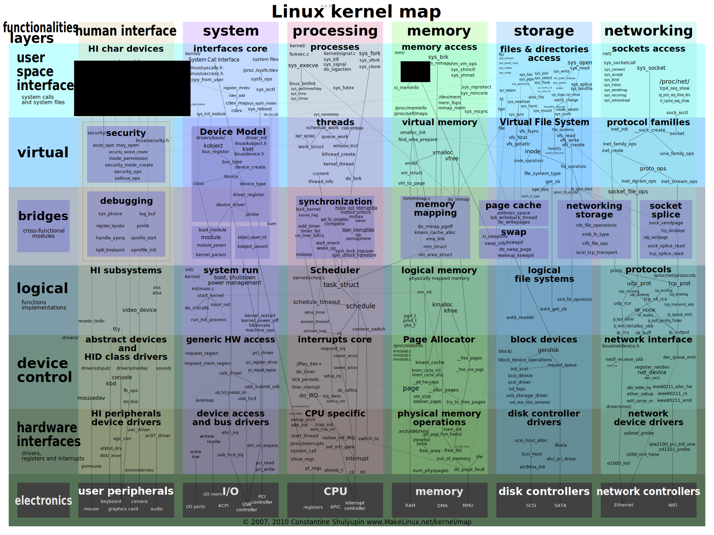
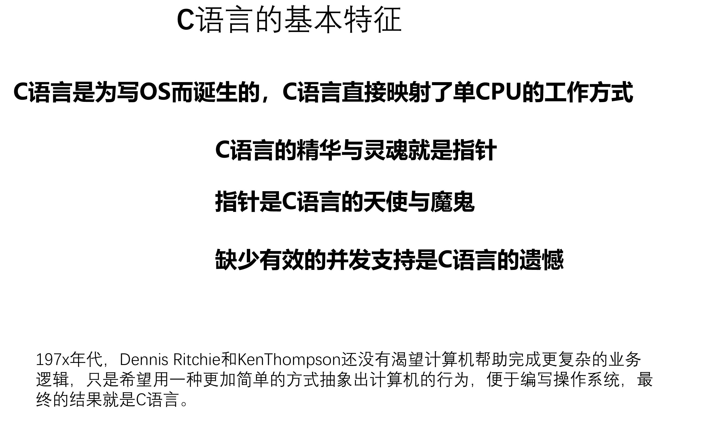
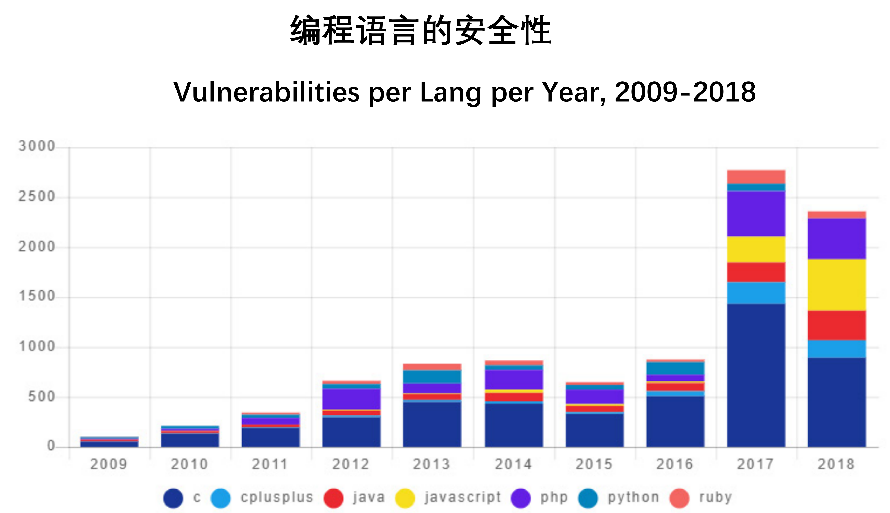
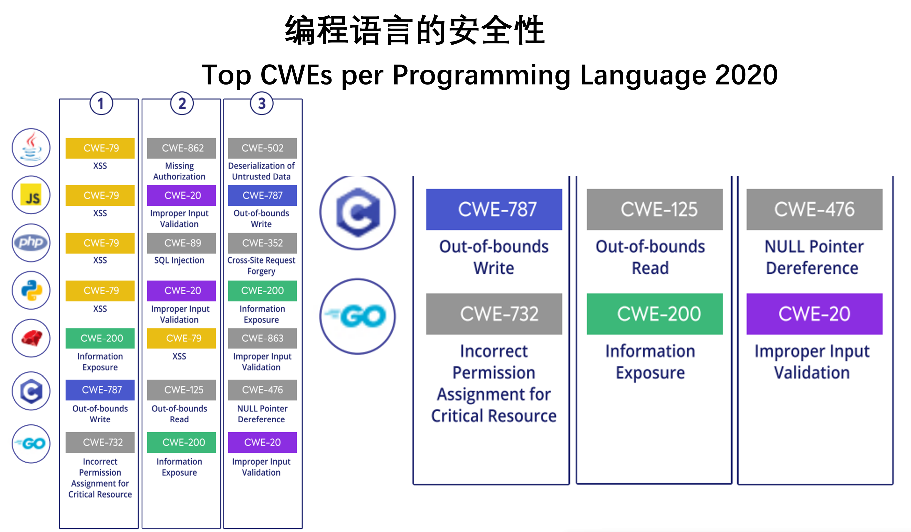
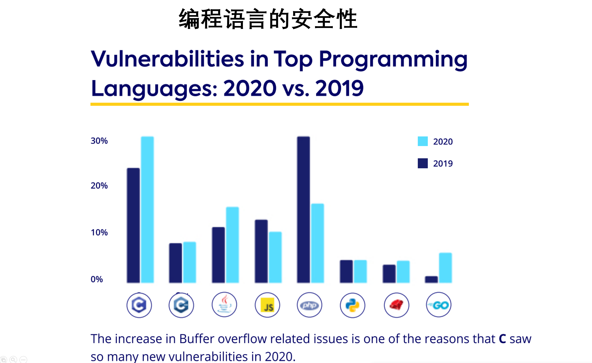

<!-- theme: gaia -->
<!-- _class: lead -->
# 操作系统内核
# 研究汇报
 
 

陈渝   

清华大学
 

2022.4.21

---

### 提纲
- **研究目标**
- **相关背景**
- **总体介绍**
- **应用分析**
- **工作基础**

---

### 提纲
- **研究目标**
  - 下一个50年的OS？
  - 应用领域
     - AIoT/Robot/VR...
  - 应用要求
     - 安全、高性能、确定性、低延时、定制化、一体化...
  - 挑战与机遇
    - 将带来OS的变革   

---

### 提纲
- **研究目标**
- **相关背景**
- **总体介绍**
- **应用分析**
- **工作基础**

---
**相关背景**  -- 产业界

 - 国内外OS 

  - 国内通用OS：
    - openeuler，统信，麒麟，龙蜥，opencloud...
    - 国内大厂支持，都基于Linux，缺少核心创新

---
**相关背景** 

 - 国内外OS -- 产业界

  - 国内嵌入式OS
     - 鸿蒙os，ali things os，腾讯TencentOS tiny，sylixos，rtt, reworks，detlaos, spaceos,...
     - 传统RTOS的简化技术，难以适应AIoT的复杂场景

---
**相关背景** -- 学术界
- 面向新型硬件，采用新型编程语言的OS研究
- 缺少生态和实际应用
- 侧重性能等方面，对安全等考虑较少

---
**相关背景** 

**OS相关问题**

- 安全问题
- 性能问题
- 研发问题
- 生态问题

---
**相关背景** -- OS 安全问题

---
**相关背景** -- OS 安全问题

---
**相关背景** -- OS 安全问题

---
**相关背景** -- OS 安全问题

---
**相关背景** -- OS 安全问题

---
**相关背景** -- OS 安全问题

---
**相关背景** -- OS 安全问题

---
**相关背景** -- OS 安全问题

---
**相关背景** -- OS 性能问题
  - 在多核支持、确定性执行、低延迟、新型硬件支持等方面还需改进

---
**相关背景** -- OS 研发问题
  - 内核代码开发难度大，代码难以复用
  - 应用开发方式无法有效重用，研发生态困难

---
**相关背景** 

OS 生态问题
- 桌面：windows
- 服务器：Linux
- 移动端：Android
- 嵌入式：VxWorks
- AIoT/Robot
  -  战国时代

---

### 提纲
- **研究目标**
- **相关背景**
- **总体介绍**
- **应用分析**
- **工作基础**

---

### 总体介绍
- 基于Rust的操作系统内核 -- zCore
  - 定位与目标
  - 关键技术
  - 当前情况

  

---
**zCore定位与目标**
**定位**
- 面向特定典型场景定制专用操作系统
   - 面向AIoT/Robot/工业控制领域
      - 现在和未来有广泛的应用需求
      - 现有通用操作系统太大太重
      - 现有嵌入式操作系统功能单一

  

---
**zCore定位与目标**
**目标**

探索用Rust语言开发OS kernel，结合软硬件协同优化达到如下具体目标：
- 安全（基于Rust语言）
- 高吞吐量（异步协程和用户态中断机制）
- 实时&通用（协作式虚拟化的隔离机制）
- 支持 POSIX接口（兼容生态）
- 内核模块可按应用方式开发（便捷开发）
  
---
**zCore关键技术**
**安全**
   - 基于Rust编程语言和基于能力的架构设计
     - 无传统C语言的内存类缺陷和并发类缺陷
     - 采用编译和运行时安全检查
     - 避免Java/Go/C#等的为安全带来的性能损失
 

---
### 总体介绍 
**zCore关键技术**

**性能**  
   - 异步协程:  async coroutine
      - 降低内存消耗
      - 减少切换开销
   - 用户态中断: usr interrupt
      - 加速进程通信性能
 
 
 
---
### 总体介绍 
**zCore关键技术**

**性能**  
  - 协作式隔离
  - 系统虚拟化
  - 保证硬实时
  - 重用Linux服务
   
---
zCore关键技术
**开发与生态**       
   - 跨特权级代码共享
     - 用户态开发调试
     - 直接运行在内核
   - 支持POSIX接口
     - 重用Linux App  
  

---

### 提纲
- **研究目标**
- **相关背景**
- **总体介绍**
- **应用分析**
- **工作基础**

---
### 应用分析
机器人领域
- 基于Linux
  - 实时/安全性不足
- 基于RTOS:VxWorks
  - 对AI等方面支持不够  

- 采用zCore+RVM
  - 同时满足实时/通用性

  

---
### 应用分析
无人系统领域
- 基于Linux
  - 实时/安全性不足
- 基于RTOS
  - 对AI等方面支持不够
  - 应用支持不够  

- 采用zCore+RVM
  - 同时满足实时/通用性
  
  

---
### 应用分析
应用架构
- 面向机器人/无人系统
  

---

### 提纲
- **研究目标**
- **相关背景**
- **总体介绍**
- **应用分析**
- **工作基础**

---
### 工作基础
Rust-base OS（2018-至今）
- rCore(kernel)
- zCore(kernel)
- RVM(虚拟机)
- 与启元实验室/复旦大学等合作

  

---
### 工作基础
Occlum LibOS (2018~2020)
- Rust-based OS
- 面向机密计算
- 与蚂蚁合作
- ASPLOS'20论文
- 产业化
  

---
### 工作基础
OpenTHOS (2016~2019)
- 桌面化Android OS
- 面向桌面应用
- 与同方合作
- 预装10万套
- 2016东亚开源软件奖
  
---
<!-- theme: gaia -->
<!-- _class: lead -->
# 谢谢

